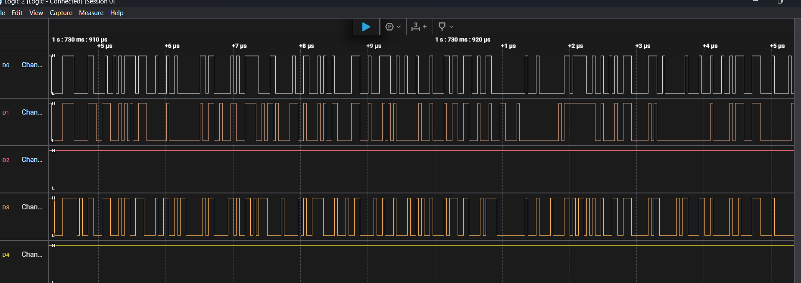
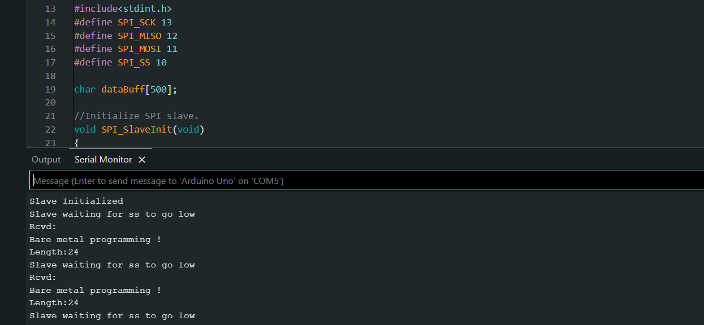

# STM32F4xx Baremetal Drivers Development


## Introduction

This repository documents my learning journey in developing baremetal drivers for STM32F4 microcontrollers (specifically tested on STM32F407G-DISC1). The primary purpose is educational - to deeply understand microcontroller internals by working directly with hardware registers, rather than creating production-ready drivers.Currently implemented drivers include:

- **GPIO** (General Purpose Input/Output)
- **SPI** (Serial Peripheral Interface)
- **I2C** (Inter-Integrated Circuit)
- **USART** (Universal Synchronous/Asynchronous Receiver/Transmitter)

**Note:** For most real-world applications, ST's HAL library remains the better choice as it's thoroughly tested and maintained. This project serves as a learning exercise in embedded systems fundamentals.

## Why Baremetal? (Learning Objectives)
- 🎓 Understand register-level microcontroller programming
- 🔍 Learn how HAL libraries abstract hardware operations
- 🧩 Master peripheral initialization and configuration
- ⚡ Observe the direct performance impact of low-level coding
- 🛠️ Develop debugging skills for hardware-level issues

## Getting Started
For fellow learners:
```bash
git clone https://github.com/GhaithhBenbrahim/stm32f4xx-baremetal-drivers.git
````

## Driver Structure

All drivers are located in the `drivers` directory. Each driver's API is documented directly in its header and source files.

## Example Usage

Below are quick examples showing how to use each driver. For complete API documentation, please refer to the comments in each driver's source files.

## Basic GPIO Examples
### 💡 Example: LED Toggle

```c
#include "stm32f407xx.h"

void delay(void) {
    for(uint32_t i = 0; i < 500000; i++);
}

int main(void) {
    GPIO_Handle_t GPIO_Led;
    
    GPIO_Led.pGPIOx = GPIOD;
    GPIO_Led.GPIO_PinConfig.GPIO_PinNumber = GPIO_PIN_NO_12;
    GPIO_Led.GPIO_PinConfig.GPIO_PinMode = GPIO_MODE_OUT;
    GPIO_Led.GPIO_PinConfig.GPIO_PinSpeed = GPIO_SPEED_FAST;
    GPIO_Led.GPIO_PinConfig.GPIO_PinOPType = GPIO_OP_TYPE_PP;
    GPIO_Led.GPIO_PinConfig.GPIO_PinPuPdControl = GPIO_NO_PUPD;
   
    GPIO_Init(&GPIO_Led);

    while(1) {
        GPIO_ToggleOutputPin(GPIOD, GPIO_PIN_NO_12);
        delay();
    }
    return 0;
}
```
## EXTI Button Interrupt Example

This example shows how to:
1. Configure GPIO pin as interrupt source (PA0 button)
2. Set up falling-edge triggered interrupt
3. Handle the interrupt to toggle an LED (PD12)
```c
/* LED Toggle with EXTI Button Interrupt Example */
#include <string.h>
#include "stm32f407xx.h"

void delay(void) {
    for(uint32_t i = 0; i<250000; i++); // Crude delay (~100ms @16MHz)
}

int main(void) {
    GPIO_Handle_t GPIO_Led, GPIO_Button;
    memset(&GPIO_Led, 0, sizeof(GPIO_Led));       // Clear LED config struct
    memset(&GPIO_Button, 0, sizeof(GPIO_Button));  // Clear button config struct

    /* LED (PD12) Configuration */
    GPIO_Led.pGPIOx = GPIOD;
    GPIO_Led.GPIO_PinConfig.GPIO_PinNumber = GPIO_PIN_NO_12;
    GPIO_Led.GPIO_PinConfig.GPIO_PinMode = GPIO_MODE_OUT;
    GPIO_Led.GPIO_PinConfig.GPIO_PinSpeed = GPIO_SPEED_FAST;
    GPIO_Led.GPIO_PinConfig.GPIO_PinOPType = GPIO_OP_TYPE_PP;
    GPIO_Led.GPIO_PinConfig.GPIO_PinPuPdControl = GPIO_NO_PUPD;
    GPIO_Init(&GPIO_Led);

    /* Button (PA0) Configuration */
    GPIO_Button.pGPIOx = GPIOA;
    GPIO_Button.GPIO_PinConfig.GPIO_PinNumber = GPIO_PIN_NO_0;
    GPIO_Button.GPIO_PinConfig.GPIO_PinMode = GPIO_MODE_IT_FT; // Falling edge trigger
    GPIO_Button.GPIO_PinConfig.GPIO_PinSpeed = GPIO_SPEED_FAST;
    GPIO_Button.GPIO_PinConfig.GPIO_PinPuPdControl = GPIO_PIN_PU; // Internal pull-up
    GPIO_Init(&GPIO_Button);

    /* NVIC Configuration */
    GPIO_IRQInterruptConfig(IRQ_NO_EXTI0, ENABLE);  // Enable EXTI0 interrupt
    GPIO_IRQPriorityConfig(IRQ_NO_EXTI0, NVIC_IRQ_PRI6); // Set priority

    while(1); // Main loop - all handled in ISR
}

/* EXTI0 Interrupt Handler */
void EXTI0_IRQHandler(void) {
    delay(); // Simple debounce
    GPIO_IRQHandling(GPIO_PIN_NO_0); // Clear pending bit
    GPIO_ToggleOutputPin(GPIOD, 12);  // Toggle LED
}
```

## SPI Examples
### STM32F4 to Arduino SPI Communication

SPI master (STM32F407) to slave (Arduino Uno) demo with 3.3V/5V logic level conversion.

### Hardware
- **STM32F4** ↔ **Logic Level Converter** ↔ **Arduino Uno**
- Connections:
  - PB12 (NSS) → D10 (SS)
  - PB13 (SCK) → D13 (SCK)
  - PB15 (MOSI) → D11 (MOSI)
  - GND → GND
- Button: PA0 to GND


### Signal Analysis
Logic analyzer capture of STM32 SPI pins during transmission:


*NSS (Yellow), SCK (Blue), MOSI (Purple)*

### Code
- **STM32 Master**: 
```c
#include<string.h>
#include "stm32f407xx.h"

void delay(void)
{
	for(uint32_t i = 0 ; i < 500000 ; i ++);
}

/*
 * PB14 --> SPI2_MISO
 * PB15 --> SPI2_MOSI
 * PB13 -> SPI2_SCLK
 * PB12 --> SPI2_NSS
 * ALT function mode : 5
 */

/* SPI Slave Demo

 *
 * SPI pin numbers:
 * SCK   13  // Serial Clock.
 * MISO  12  // Master In Slave Out.
 * MOSI  11  // Master Out Slave In.
 * SS    10  // Slave Select . Arduino SPI pins respond only if SS pulled low by the master
 *

 */

void SPI2_GPIOInits(void)
{
	GPIO_Handle_t SPIPins;

	SPIPins.pGPIOx = GPIOB;
	SPIPins.GPIO_PinConfig.GPIO_PinMode = GPIO_MODE_ALTFN;
	SPIPins.GPIO_PinConfig.GPIO_PinAltFunMode = 5;
	SPIPins.GPIO_PinConfig.GPIO_PinOPType = GPIO_OP_TYPE_PP;
	SPIPins.GPIO_PinConfig.GPIO_PinPuPdControl = GPIO_NO_PUPD;
	SPIPins.GPIO_PinConfig.GPIO_PinSpeed = GPIO_SPEED_FAST;

	//SCLK
	SPIPins.GPIO_PinConfig.GPIO_PinNumber = GPIO_PIN_NO_13;
	GPIO_Init(&SPIPins);

	//MOSI
	SPIPins.GPIO_PinConfig.GPIO_PinNumber = GPIO_PIN_NO_15;
	GPIO_Init(&SPIPins);

	//MISO
	//SPIPins.GPIO_PinConfig.GPIO_PinNumber = GPIO_PIN_NO_14;
	//GPIO_Init(&SPIPins);


	//NSS
	SPIPins.GPIO_PinConfig.GPIO_PinNumber = GPIO_PIN_NO_12;
	GPIO_Init(&SPIPins);


}

void SPI2_Inits(void)
{

	SPI_Handle_t SPI2handle;

	SPI2handle.pSPIx = SPI2;
	SPI2handle.SPIConfig.SPI_BusConfig = SPI_BUS_CONFIG_FD;
	SPI2handle.SPIConfig.SPI_DeviceMode = SPI_DEVICE_MODE_MASTER;
	SPI2handle.SPIConfig.SPI_SclkSpeed = SPI_SCLK_SPEED_DIV32;
	SPI2handle.SPIConfig.SPI_DFF = SPI_DFF_8BITS;
	SPI2handle.SPIConfig.SPI_CPOL = SPI_CPOL_LOW;
	SPI2handle.SPIConfig.SPI_CPHA = SPI_CPHA_LOW;
	SPI2handle.SPIConfig.SPI_SSM = SPI_SSM_DI; //Hardware slave management enabled for NSS pin

	SPI_Init(&SPI2handle);
}

void GPIO_ButtonInit(void)
{
	GPIO_Handle_t GPIOBtn;

	//this is btn gpio configuration
	GPIOBtn.pGPIOx = GPIOA;
	GPIOBtn.GPIO_PinConfig.GPIO_PinNumber = GPIO_PIN_NO_0;
	GPIOBtn.GPIO_PinConfig.GPIO_PinMode = GPIO_MODE_IN;
	GPIOBtn.GPIO_PinConfig.GPIO_PinSpeed = GPIO_SPEED_FAST;
	GPIOBtn.GPIO_PinConfig.GPIO_PinPuPdControl = GPIO_NO_PUPD;

	GPIO_Init(&GPIOBtn);

}


int main(void)
{
	char user_data[] = "Bare metal programming !";

	GPIO_ButtonInit();

	//this function is used to initialize the GPIO pins to behave as SPI2 pins
	SPI2_GPIOInits();

	//This function is used to initialize the SPI2 peripheral parameters
	SPI2_Inits();

	/*
	* making SSOE 1 does NSS output enable.
	* The NSS pin is automatically managed by the hardware.
	* i.e when SPE=1 , NSS will be pulled to low
	* and NSS pin will be high when SPE=0
	*/
	SPI_SSOEConfig(SPI2,ENABLE);

	while(1)
	{
		//wait till button is pressed
		while( ! GPIO_ReadFromInputPin(GPIOA,GPIO_PIN_NO_0) );

		//to avoid button de-bouncing related issues 200ms of delay
		delay();

		//enable the SPI2 peripheral
		SPI_PeripheralControl(SPI2,ENABLE);

		//first send length information
		uint8_t dataLen = strlen(user_data);
		SPI_SendData(SPI2,&dataLen,1);

		//to send data
		SPI_SendData(SPI2,(uint8_t*)user_data,strlen(user_data));

		//lets confirm SPI is not busy
		while( SPI_GetFlagStatus(SPI2,SPI_BUSY_FLAG) );

		//Disable the SPI2 peripheral
		SPI_PeripheralControl(SPI2,DISABLE);
	}

	return 0;

}
```
- **Arduino Slave**: `arduino_code/` (Basic SPI slave implementation)

## Behavior
1. Button press triggers STM32 to send message
2. Logic analyzer verifies signal integrity
3. Arduino displays received message at 9600 baud



## Requirements
- Logic level converter (3.3V ↔ 5V)
- Saleae/PulseView for signal analysis
- STM32CubeIDE/Arduino IDE

## 🤝 How to Contribute
- Report bugs via Issues
- Submit PRs with:
  - Hardware-tested code
  - Doxygen documentation
  - Example usage (if adding features)

## 📜 License

This project is licensed under the **MIT License** - see the [LICENSE](LICENSE) file for details.
