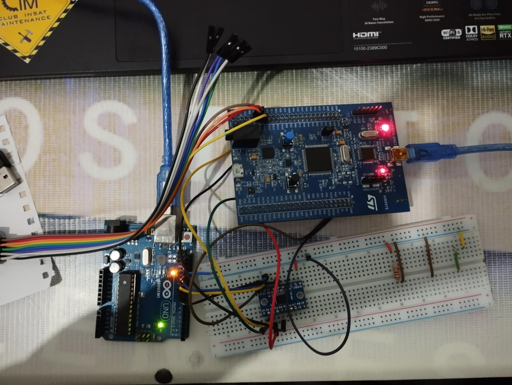
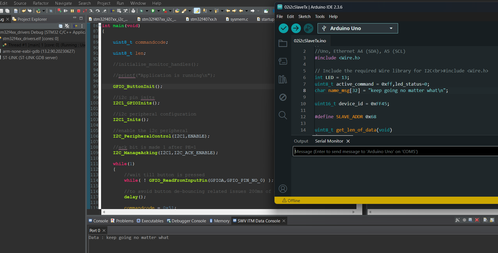
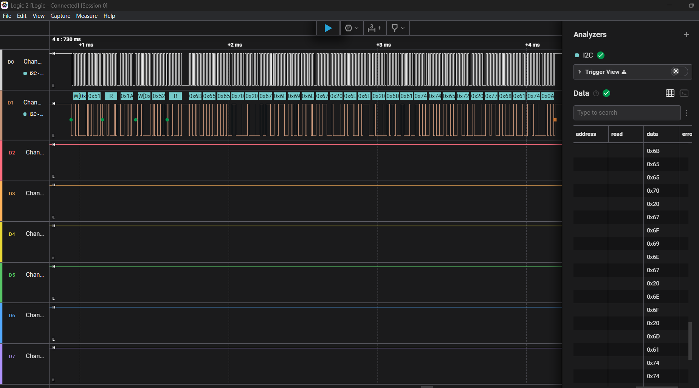
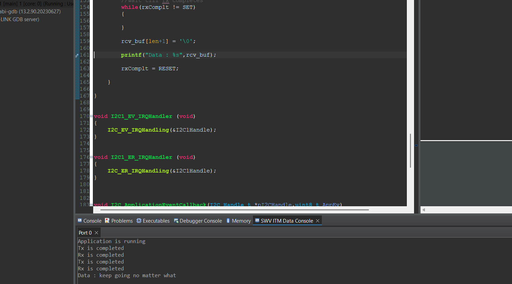
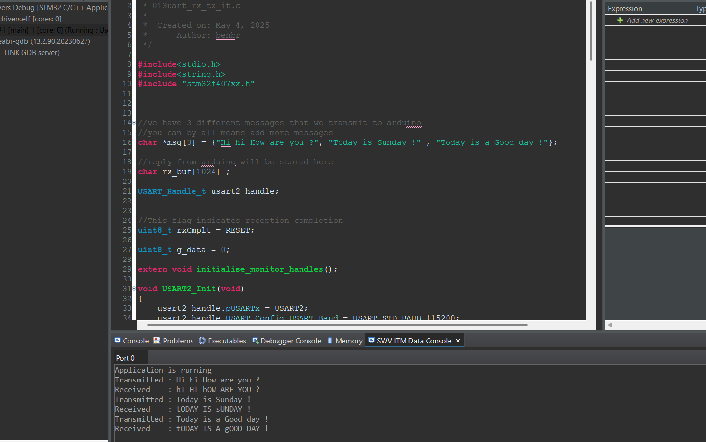
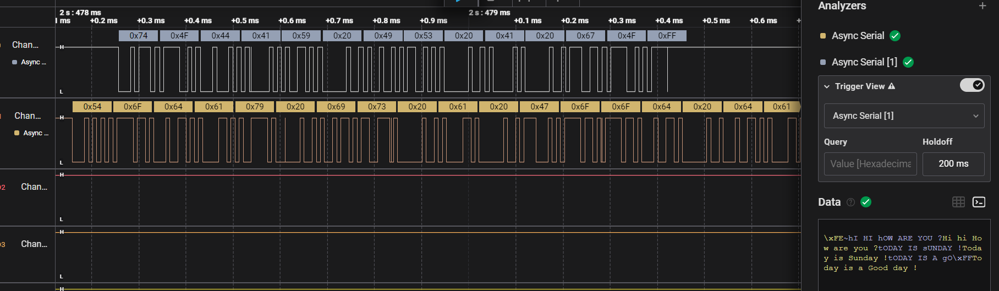

# STM32F4xx Baremetal Drivers Development


## Introduction

This repository documents my learning journey in developing baremetal drivers for STM32F4 microcontrollers (specifically tested on STM32F407G-DISC1). The primary purpose is educational - to deeply understand microcontroller internals by working directly with hardware registers, rather than creating production-ready drivers.Currently implemented drivers include:

- **GPIO** (General Purpose Input/Output)
- **SPI** (Serial Peripheral Interface)
- **I2C** (Inter-Integrated Circuit)
- **USART** (Universal Synchronous/Asynchronous Receiver/Transmitter)

**Note:** For most real-world applications, ST's HAL library remains the better choice as it's thoroughly tested and maintained. This project serves as a learning exercise in embedded systems fundamentals.

## Why Baremetal? (Learning Objectives)
- 🎓 Understand register-level microcontroller programming
- 🔍 Learn how HAL libraries abstract hardware operations
- 🧩 Master peripheral initialization and configuration
- ⚡ Observe the direct performance impact of low-level coding
- 🛠️ Develop debugging skills for hardware-level issues

## Getting Started
For fellow learners:
```bash
git clone https://github.com/GhaithhBenbrahim/stm32f4xx-baremetal-drivers.git
````

## Driver Structure

All drivers are located in the `drivers` directory. Each driver's API is documented directly in its header and source files.

## Example Usage

Below are quick examples showing how to use each driver. For complete API documentation, please refer to the comments in each driver's source files.

## Basic GPIO Examples
### 💡 Example: LED Toggle

```c
#include "stm32f407xx.h"

void delay(void) {
    for(uint32_t i = 0; i < 500000; i++);
}

int main(void) {
    GPIO_Handle_t GPIO_Led;
    
    GPIO_Led.pGPIOx = GPIOD;
    GPIO_Led.GPIO_PinConfig.GPIO_PinNumber = GPIO_PIN_NO_12;
    GPIO_Led.GPIO_PinConfig.GPIO_PinMode = GPIO_MODE_OUT;
    GPIO_Led.GPIO_PinConfig.GPIO_PinSpeed = GPIO_SPEED_FAST;
    GPIO_Led.GPIO_PinConfig.GPIO_PinOPType = GPIO_OP_TYPE_PP;
    GPIO_Led.GPIO_PinConfig.GPIO_PinPuPdControl = GPIO_NO_PUPD;
   
    GPIO_Init(&GPIO_Led);

    while(1) {
        GPIO_ToggleOutputPin(GPIOD, GPIO_PIN_NO_12);
        delay();
    }
    return 0;
}
```
## EXTI Button Interrupt Example

This example shows how to:
1. Configure GPIO pin as interrupt source (PA0 button)
2. Set up falling-edge triggered interrupt
3. Handle the interrupt to toggle an LED (PD12)
```c
/* LED Toggle with EXTI Button Interrupt Example */
#include <string.h>
#include "stm32f407xx.h"

void delay(void) {
    for(uint32_t i = 0; i<250000; i++); // Crude delay (~100ms @16MHz)
}

int main(void) {
    GPIO_Handle_t GPIO_Led, GPIO_Button;
    memset(&GPIO_Led, 0, sizeof(GPIO_Led));       // Clear LED config struct
    memset(&GPIO_Button, 0, sizeof(GPIO_Button));  // Clear button config struct

    /* LED (PD12) Configuration */
    GPIO_Led.pGPIOx = GPIOD;
    GPIO_Led.GPIO_PinConfig.GPIO_PinNumber = GPIO_PIN_NO_12;
    GPIO_Led.GPIO_PinConfig.GPIO_PinMode = GPIO_MODE_OUT;
    GPIO_Led.GPIO_PinConfig.GPIO_PinSpeed = GPIO_SPEED_FAST;
    GPIO_Led.GPIO_PinConfig.GPIO_PinOPType = GPIO_OP_TYPE_PP;
    GPIO_Led.GPIO_PinConfig.GPIO_PinPuPdControl = GPIO_NO_PUPD;
    GPIO_Init(&GPIO_Led);

    /* Button (PA0) Configuration */
    GPIO_Button.pGPIOx = GPIOA;
    GPIO_Button.GPIO_PinConfig.GPIO_PinNumber = GPIO_PIN_NO_0;
    GPIO_Button.GPIO_PinConfig.GPIO_PinMode = GPIO_MODE_IT_FT; // Falling edge trigger
    GPIO_Button.GPIO_PinConfig.GPIO_PinSpeed = GPIO_SPEED_FAST;
    GPIO_Button.GPIO_PinConfig.GPIO_PinPuPdControl = GPIO_PIN_PU; // Internal pull-up
    GPIO_Init(&GPIO_Button);

    /* NVIC Configuration */
    GPIO_IRQInterruptConfig(IRQ_NO_EXTI0, ENABLE);  // Enable EXTI0 interrupt
    GPIO_IRQPriorityConfig(IRQ_NO_EXTI0, NVIC_IRQ_PRI6); // Set priority

    while(1); // Main loop - all handled in ISR
}

/* EXTI0 Interrupt Handler */
void EXTI0_IRQHandler(void) {
    delay(); // Simple debounce
    GPIO_IRQHandling(GPIO_PIN_NO_0); // Clear pending bit
    GPIO_ToggleOutputPin(GPIOD, 12);  // Toggle LED
}
```

## SPI Examples
### STM32F4 to Arduino SPI Communication

SPI master (STM32F407) to slave (Arduino Uno) demo with 3.3V/5V logic level conversion.

### Hardware
- **STM32F4** ↔ **Logic Level Converter** ↔ **Arduino Uno**
- Connections:
  - PB12 (NSS) → D10 (SS)
  - PB13 (SCK) → D13 (SCK)
  - PB15 (MOSI) → D11 (MOSI)
  - GND → GND
- Button: PA0 to GND



### Signal Analysis
Logic analyzer capture of STM32 SPI pins during transmission:


*NSS (Yellow), SCK (Blue), MOSI (Purple)*

### Code
- **STM32 Master**: 
```c
#include<string.h>
#include "stm32f407xx.h"

void delay(void)
{
	for(uint32_t i = 0 ; i < 500000 ; i ++);
}

/*
 * PB14 --> SPI2_MISO
 * PB15 --> SPI2_MOSI
 * PB13 -> SPI2_SCLK
 * PB12 --> SPI2_NSS
 * ALT function mode : 5
 */

/* SPI Slave Demo

 *
 * SPI pin numbers:
 * SCK   13  // Serial Clock.
 * MISO  12  // Master In Slave Out.
 * MOSI  11  // Master Out Slave In.
 * SS    10  // Slave Select . Arduino SPI pins respond only if SS pulled low by the master
 *

 */

void SPI2_GPIOInits(void)
{
	GPIO_Handle_t SPIPins;

	SPIPins.pGPIOx = GPIOB;
	SPIPins.GPIO_PinConfig.GPIO_PinMode = GPIO_MODE_ALTFN;
	SPIPins.GPIO_PinConfig.GPIO_PinAltFunMode = 5;
	SPIPins.GPIO_PinConfig.GPIO_PinOPType = GPIO_OP_TYPE_PP;
	SPIPins.GPIO_PinConfig.GPIO_PinPuPdControl = GPIO_NO_PUPD;
	SPIPins.GPIO_PinConfig.GPIO_PinSpeed = GPIO_SPEED_FAST;

	//SCLK
	SPIPins.GPIO_PinConfig.GPIO_PinNumber = GPIO_PIN_NO_13;
	GPIO_Init(&SPIPins);

	//MOSI
	SPIPins.GPIO_PinConfig.GPIO_PinNumber = GPIO_PIN_NO_15;
	GPIO_Init(&SPIPins);

	//MISO
	//SPIPins.GPIO_PinConfig.GPIO_PinNumber = GPIO_PIN_NO_14;
	//GPIO_Init(&SPIPins);


	//NSS
	SPIPins.GPIO_PinConfig.GPIO_PinNumber = GPIO_PIN_NO_12;
	GPIO_Init(&SPIPins);


}

void SPI2_Inits(void)
{

	SPI_Handle_t SPI2handle;

	SPI2handle.pSPIx = SPI2;
	SPI2handle.SPIConfig.SPI_BusConfig = SPI_BUS_CONFIG_FD;
	SPI2handle.SPIConfig.SPI_DeviceMode = SPI_DEVICE_MODE_MASTER;
	SPI2handle.SPIConfig.SPI_SclkSpeed = SPI_SCLK_SPEED_DIV32;
	SPI2handle.SPIConfig.SPI_DFF = SPI_DFF_8BITS;
	SPI2handle.SPIConfig.SPI_CPOL = SPI_CPOL_LOW;
	SPI2handle.SPIConfig.SPI_CPHA = SPI_CPHA_LOW;
	SPI2handle.SPIConfig.SPI_SSM = SPI_SSM_DI; //Hardware slave management enabled for NSS pin

	SPI_Init(&SPI2handle);
}

void GPIO_ButtonInit(void)
{
	GPIO_Handle_t GPIOBtn;

	//this is btn gpio configuration
	GPIOBtn.pGPIOx = GPIOA;
	GPIOBtn.GPIO_PinConfig.GPIO_PinNumber = GPIO_PIN_NO_0;
	GPIOBtn.GPIO_PinConfig.GPIO_PinMode = GPIO_MODE_IN;
	GPIOBtn.GPIO_PinConfig.GPIO_PinSpeed = GPIO_SPEED_FAST;
	GPIOBtn.GPIO_PinConfig.GPIO_PinPuPdControl = GPIO_NO_PUPD;

	GPIO_Init(&GPIOBtn);

}


int main(void)
{
	char user_data[] = "Bare metal programming !";

	GPIO_ButtonInit();

	//this function is used to initialize the GPIO pins to behave as SPI2 pins
	SPI2_GPIOInits();

	//This function is used to initialize the SPI2 peripheral parameters
	SPI2_Inits();

	/*
	* making SSOE 1 does NSS output enable.
	* The NSS pin is automatically managed by the hardware.
	* i.e when SPE=1 , NSS will be pulled to low
	* and NSS pin will be high when SPE=0
	*/
	SPI_SSOEConfig(SPI2,ENABLE);

	while(1)
	{
		//wait till button is pressed
		while( ! GPIO_ReadFromInputPin(GPIOA,GPIO_PIN_NO_0) );

		//to avoid button de-bouncing related issues 200ms of delay
		delay();

		//enable the SPI2 peripheral
		SPI_PeripheralControl(SPI2,ENABLE);

		//first send length information
		uint8_t dataLen = strlen(user_data);
		SPI_SendData(SPI2,&dataLen,1);

		//to send data
		SPI_SendData(SPI2,(uint8_t*)user_data,strlen(user_data));

		//lets confirm SPI is not busy
		while( SPI_GetFlagStatus(SPI2,SPI_BUSY_FLAG) );

		//Disable the SPI2 peripheral
		SPI_PeripheralControl(SPI2,DISABLE);
	}

	return 0;

}
```
- **Arduino Slave**: `arduino_code/` (Basic SPI slave implementation)

## Behavior
1. Button press triggers STM32 to send message
2. Logic analyzer verifies signal integrity
3. Arduino displays received message at 9600 baud


## Requirements
- Logic level converter (3.3V ↔ 5V)
- Saleae/PulseView for signal analysis
- STM32CubeIDE/Arduino IDE

## SPI master stm rx Interrupt
```c
#include<stdio.h>
#include<string.h>
#include "stm32f407xx.h"


SPI_Handle_t SPI2handle;

#define MAX_LEN 500

char RcvBuff[MAX_LEN];

volatile char ReadByte;


volatile uint8_t rcvStop = 0;

/*This flag will be set in the interrupt handler of the Arduino interrupt GPIO */
volatile uint8_t dataAvailable = 0;

void delay(void)
{
	for(uint32_t i = 0 ; i < 500000/2 ; i ++);
}

/*
 * PB14 --> SPI2_MISO
 * PB15 --> SPI2_MOSI
 * PB13 -> SPI2_SCLK
 * PB12 --> SPI2_NSS
 * ALT function mode : 5
 */

void SPI2_GPIOInits(void)
{
	GPIO_Handle_t SPIPins;

	SPIPins.pGPIOx = GPIOB;
	SPIPins.GPIO_PinConfig.GPIO_PinMode = GPIO_MODE_ALTFN;
	SPIPins.GPIO_PinConfig.GPIO_PinAltFunMode = 5;
	SPIPins.GPIO_PinConfig.GPIO_PinOPType = GPIO_OP_TYPE_PP;
	SPIPins.GPIO_PinConfig.GPIO_PinPuPdControl = GPIO_NO_PUPD;
	SPIPins.GPIO_PinConfig.GPIO_PinSpeed = GPIO_SPEED_FAST;

	//SCLK
	SPIPins.GPIO_PinConfig.GPIO_PinNumber = GPIO_PIN_NO_13;
	GPIO_Init(&SPIPins);

	//MOSI
    SPIPins.GPIO_PinConfig.GPIO_PinNumber = GPIO_PIN_NO_15;
	GPIO_Init(&SPIPins);

	//MISO
	SPIPins.GPIO_PinConfig.GPIO_PinNumber = GPIO_PIN_NO_14;
	GPIO_Init(&SPIPins);


	//NSS
	SPIPins.GPIO_PinConfig.GPIO_PinNumber = GPIO_PIN_NO_12;
	GPIO_Init(&SPIPins);


}

void SPI2_Inits(void)
{
	SPI2handle.pSPIx = SPI2;
	SPI2handle.SPIConfig.SPI_BusConfig = SPI_BUS_CONFIG_FD;
	SPI2handle.SPIConfig.SPI_DeviceMode = SPI_DEVICE_MODE_MASTER;
	SPI2handle.SPIConfig.SPI_SclkSpeed = SPI_SCLK_SPEED_DIV32;
	SPI2handle.SPIConfig.SPI_DFF = SPI_DFF_8BITS;
	SPI2handle.SPIConfig.SPI_CPOL = SPI_CPOL_LOW;
	SPI2handle.SPIConfig.SPI_CPHA = SPI_CPHA_LOW;
	SPI2handle.SPIConfig.SPI_SSM = SPI_SSM_DI; //Hardware slave management enabled for NSS pin

	SPI_Init(&SPI2handle);
}


/*This function configures the gpio pin over which SPI peripheral issues data available interrupt */
void Slave_GPIO_InterruptPinInit(void)
{
	GPIO_Handle_t spiIntPin;
	memset(&spiIntPin,0,sizeof(spiIntPin));

	//this is led gpio configuration
	spiIntPin.pGPIOx = GPIOD;
	spiIntPin.GPIO_PinConfig.GPIO_PinNumber = GPIO_PIN_NO_6;
	spiIntPin.GPIO_PinConfig.GPIO_PinMode = GPIO_MODE_IT_FT;
	spiIntPin.GPIO_PinConfig.GPIO_PinSpeed = GPIO_SPEED_LOW;
	spiIntPin.GPIO_PinConfig.GPIO_PinPuPdControl = GPIO_PIN_PU;

	GPIO_Init(&spiIntPin);

	GPIO_IRQPriorityConfig(IRQ_NO_EXTI9_5,NVIC_IRQ_PRI15);
	GPIO_IRQInterruptConfig(IRQ_NO_EXTI9_5,ENABLE);

}


int main(void)
{

	uint8_t dummy = 0xff;

	Slave_GPIO_InterruptPinInit();

	//this function is used to initialize the GPIO pins to behave as SPI2 pins
	SPI2_GPIOInits();

	//This function is used to initialize the SPI2 peripheral parameters
	SPI2_Inits();

	/*
	* making SSOE 1 does NSS output enable.
	* The NSS pin is automatically managed by the hardware.
	* i.e when SPE=1 , NSS will be pulled to low
	* and NSS pin will be high when SPE=0
	*/
	SPI_SSOEConfig(SPI2,ENABLE);

	SPI_IRQInterruptConfig(IRQ_NO_SPI2,ENABLE);

	while(1){

		rcvStop = 0;

		while(!dataAvailable); //wait till data available interrupt from transmitter device(slave)

		GPIO_IRQInterruptConfig(IRQ_NO_EXTI9_5,DISABLE);

		//enable the SPI2 peripheral
		SPI_PeripheralControl(SPI2,ENABLE);


		while(!rcvStop)
		{
			/* fetch the data from the SPI peripheral byte by byte in interrupt mode */
			while ( SPI_SendDataIT(&SPI2handle,&dummy,1) == SPI_BUSY_IN_TX);
			while ( SPI_ReceiveDataIT(&SPI2handle,&ReadByte,1) == SPI_BUSY_IN_RX );
		}


		// confirm SPI is not busy
		while( SPI_GetFlagStatus(SPI2,SPI_BUSY_FLAG) );

		//Disable the SPI2 peripheral
		SPI_PeripheralControl(SPI2,DISABLE);

		printf("Rcvd data = %s\n",RcvBuff);

		dataAvailable = 0;

		GPIO_IRQInterruptConfig(IRQ_NO_EXTI9_5,ENABLE);


	}

	return 0;

}

/* Runs when a data byte is received from the peripheral over SPI*/
void SPI2_IRQHandler(void)
{

	SPI_IRQHandling(&SPI2handle);
}


void SPI_ApplicationEventCallback(SPI_Handle_t *pSPIHandle,uint8_t AppEv)
{
	static uint32_t i = 0;
	/* In the RX complete event , copy data in to rcv buffer . '\0' indicates end of message(rcvStop = 1) */
	if(AppEv == SPI_EVENT_RX_CMPLT)
	{
				RcvBuff[i++] = ReadByte;
				if(ReadByte == '\0' || ( i == MAX_LEN)){
					rcvStop = 1;
					RcvBuff[i-1] = '\0';
					i = 0;
				}
	}

}

/* Slave data available interrupt handler */
void EXTI9_5_IRQHandler(void)
{
	GPIO_IRQHandling(GPIO_PIN_NO_6);
	dataAvailable = 1;
}
```

## I2C Examples

### I2C Master Communication Example
**STM32F407 as I2C master with button-triggered data request**

### Hardware Connections
| STM32F4 Pin | Connection       | Notes                     |
|-------------|------------------|---------------------------|
| PB6         | SCL              | I2C1 clock line           |
| PB7         | SDA              | I2C1 data line            |
| PA0         | Push Button      | Active-low button input   |
| GND         | Device GND       | Common ground reference   |

### Protocol Description
The example implements a simple request-response protocol:
1. **Length Request Phase**:
   - Master sends command `0x51`
   - Slave responds with data length (1 byte)
2. **Data Request Phase**:
   - Master sends command `0x52`
   - Slave responds with actual data

### Key Features
- 7-bit addressing (slave address: `0x68`)
- Standard mode (100kHz)
- Hardware-managed ACK/NACK
- Button-triggered communication
- Polling-based operation

## Code Implementation

```c
#include<stdio.h>
#include<string.h>
#include "stm32f407xx.h"

//extern void initialise_monitor_handles();


#define STM_ADDR 0x61;

#define SLAVE_ADDR  0x68

void delay(void)
{
	for(uint32_t i = 0 ; i < 500000/2 ; i ++);
}

I2C_Handle_t I2C1Handle;

//rcv buffer
uint8_t rcv_buf[32];

/*
 * PB6-> SCL
 * PB7 -> SDA
 */

void I2C1_GPIOInits(void)
{
	GPIO_Handle_t I2CPins;

	I2CPins.pGPIOx = GPIOB;
	I2CPins.GPIO_PinConfig.GPIO_PinMode = GPIO_MODE_ALTFN;
	I2CPins.GPIO_PinConfig.GPIO_PinOPType = GPIO_OP_TYPE_OD;
	I2CPins.GPIO_PinConfig.GPIO_PinPuPdControl = GPIO_PIN_PU;
	I2CPins.GPIO_PinConfig.GPIO_PinAltFunMode = 4;
	I2CPins. GPIO_PinConfig.GPIO_PinSpeed = GPIO_SPEED_FAST;

	//scl
	I2CPins.GPIO_PinConfig.GPIO_PinNumber = GPIO_PIN_NO_6;
	GPIO_Init(&I2CPins);


	//sda
	I2CPins.GPIO_PinConfig.GPIO_PinNumber = GPIO_PIN_NO_7;
	GPIO_Init(&I2CPins);


}

void I2C1_Inits(void)
{
	I2C1Handle.pI2Cx = I2C1;
	I2C1Handle.I2C_Config.I2C_AckControl = I2C_ACK_ENABLE;
	I2C1Handle.I2C_Config.I2C_DeviceAddress = STM_ADDR;
	I2C1Handle.I2C_Config.I2C_FMDutyCycle = I2C_FM_DUTY_2;
	I2C1Handle.I2C_Config.I2C_SCLSpeed = I2C_SCL_SPEED_SM;

	I2C_Init(&I2C1Handle);

}

void GPIO_ButtonInit(void)
{
	GPIO_Handle_t GPIOBtn;

	//this is btn gpio configuration
	GPIOBtn.pGPIOx = GPIOA;
	GPIOBtn.GPIO_PinConfig.GPIO_PinNumber = GPIO_PIN_NO_0;
	GPIOBtn.GPIO_PinConfig.GPIO_PinMode = GPIO_MODE_IN;
	GPIOBtn.GPIO_PinConfig.GPIO_PinSpeed = GPIO_SPEED_FAST;
	GPIOBtn.GPIO_PinConfig.GPIO_PinPuPdControl = GPIO_NO_PUPD;

	GPIO_Init(&GPIOBtn);

}


int main(void)
{

	uint8_t commandcode;

	uint8_t len;


	printf("Application is running\n");

	GPIO_ButtonInit();

	//i2c pin inits
	I2C1_GPIOInits();

	//i2c peripheral configuration
	I2C1_Inits();

	//enable the i2c peripheral
	I2C_PeripheralControl(I2C1,ENABLE);

	//ack bit is made 1 after PE=1
	I2C_ManageAcking(I2C1,I2C_ACK_ENABLE);

	while(1)
	{
		//wait till button is pressed
		while( ! GPIO_ReadFromInputPin(GPIOA,GPIO_PIN_NO_0) );

		//to avoid button de-bouncing related issues 200ms of delay
		delay();

		commandcode = 0x51;

		I2C_MasterSendData(&I2C1Handle,&commandcode,1,SLAVE_ADDR,I2C_ENABLE_SR);

		I2C_MasterReceiveData(&I2C1Handle,&len,1,SLAVE_ADDR,I2C_ENABLE_SR);

		commandcode = 0x52;
		I2C_MasterSendData(&I2C1Handle,&commandcode,1,SLAVE_ADDR,I2C_ENABLE_SR);


		I2C_MasterReceiveData(&I2C1Handle,rcv_buf,len,SLAVE_ADDR,I2C_DISABLE_SR);

		rcv_buf[len+1] = '\0';

		printf("Data : %s",rcv_buf);

	}

}
```
### Example Behavior
  
*SWV terminal showing button-triggered I2C communications*

### Signal Verification
  
*I2C transaction captured on logic analyzer 

### I2C Master Communication with Interrupt 
```c
#include<stdio.h>
#include<string.h>
#include "stm32f407xx.h"

extern void initialise_monitor_handles();

//Flag variable
uint8_t rxComplt = RESET;

#define MY_ADDR 0x61;

#define SLAVE_ADDR  0x68

void delay(void)
{
	for(uint32_t i = 0 ; i < 500000/2 ; i ++);
}

I2C_Handle_t I2C1Handle;

//rcv buffer
uint8_t rcv_buf[32];

/*
 * PB6-> SCL
 * PB7 -> SDA
 */

void I2C1_GPIOInits(void)
{
	GPIO_Handle_t I2CPins;

	I2CPins.pGPIOx = GPIOB;
	I2CPins.GPIO_PinConfig.GPIO_PinMode = GPIO_MODE_ALTFN;
	I2CPins.GPIO_PinConfig.GPIO_PinOPType = GPIO_OP_TYPE_OD;
	I2CPins.GPIO_PinConfig.GPIO_PinPuPdControl = GPIO_PIN_PU;
	I2CPins.GPIO_PinConfig.GPIO_PinAltFunMode = 4;
	I2CPins. GPIO_PinConfig.GPIO_PinSpeed = GPIO_SPEED_FAST;

	//scl
	I2CPins.GPIO_PinConfig.GPIO_PinNumber = GPIO_PIN_NO_6;
	GPIO_Init(&I2CPins);


	//sda
	I2CPins.GPIO_PinConfig.GPIO_PinNumber = GPIO_PIN_NO_7;
	GPIO_Init(&I2CPins);


}

void I2C1_Inits(void)
{
	I2C1Handle.pI2Cx = I2C1;
	I2C1Handle.I2C_Config.I2C_AckControl = I2C_ACK_ENABLE;
	I2C1Handle.I2C_Config.I2C_DeviceAddress = MY_ADDR;
	I2C1Handle.I2C_Config.I2C_FMDutyCycle = I2C_FM_DUTY_2;
	I2C1Handle.I2C_Config.I2C_SCLSpeed = I2C_SCL_SPEED_SM;

	I2C_Init(&I2C1Handle);

}

void GPIO_ButtonInit(void)
{
	GPIO_Handle_t GPIOBtn,GpioLed;

	//this is btn gpio configuration
	GPIOBtn.pGPIOx = GPIOA;
	GPIOBtn.GPIO_PinConfig.GPIO_PinNumber = GPIO_PIN_NO_0;
	GPIOBtn.GPIO_PinConfig.GPIO_PinMode = GPIO_MODE_IN;
	GPIOBtn.GPIO_PinConfig.GPIO_PinSpeed = GPIO_SPEED_FAST;
	GPIOBtn.GPIO_PinConfig.GPIO_PinPuPdControl = GPIO_NO_PUPD;

	GPIO_Init(&GPIOBtn);

	//this is led gpio configuration
	GpioLed.pGPIOx = GPIOD;
	GpioLed.GPIO_PinConfig.GPIO_PinNumber = GPIO_PIN_NO_12;
	GpioLed.GPIO_PinConfig.GPIO_PinMode = GPIO_MODE_OUT;
	GpioLed.GPIO_PinConfig.GPIO_PinSpeed = GPIO_SPEED_FAST;
	GpioLed.GPIO_PinConfig.GPIO_PinOPType = GPIO_OP_TYPE_OD;
	GpioLed.GPIO_PinConfig.GPIO_PinPuPdControl = GPIO_NO_PUPD;

	GPIO_PeriClockControl(GPIOD,ENABLE);

	GPIO_Init(&GpioLed);

}


int main(void)
{

	uint8_t commandcode;

	uint8_t len;

	initialise_monitor_handles();

	printf("Application is running\n");

	GPIO_ButtonInit();

	//i2c pin inits
	I2C1_GPIOInits();

	//i2c peripheral configuration
	I2C1_Inits();

	//I2C IRQ configurations
	I2C_IRQInterruptConfig(IRQ_NO_I2C1_EV,ENABLE);
	I2C_IRQInterruptConfig(IRQ_NO_I2C1_ER,ENABLE);

	//enable the i2c peripheral
	I2C_PeripheralControl(I2C1,ENABLE);

	//ack bit is made 1 after PE=1
	I2C_ManageAcking(I2C1,I2C_ACK_ENABLE);

	while(1)
	{
		//wait till button is pressed
		while( ! GPIO_ReadFromInputPin(GPIOA,GPIO_PIN_NO_0) );

		//to avoid button de-bouncing related issues 200ms of delay
		delay();

		commandcode = 0x51;


		while(I2C_MasterSendDataIT(&I2C1Handle,&commandcode,1,SLAVE_ADDR,I2C_ENABLE_SR) != I2C_READY);

		while(I2C_MasterReceiveDataIT(&I2C1Handle,&len,1,SLAVE_ADDR,I2C_ENABLE_SR)!= I2C_READY);


		commandcode = 0x52;
		while(I2C_MasterSendDataIT(&I2C1Handle,&commandcode,1,SLAVE_ADDR,I2C_ENABLE_SR) != I2C_READY);


		while(I2C_MasterReceiveDataIT(&I2C1Handle,rcv_buf,len,SLAVE_ADDR,I2C_DISABLE_SR)!= I2C_READY);

		rxComplt = RESET;

		//wait till rx completes
        while(rxComplt != SET)
        {

        }

		rcv_buf[len+1] = '\0';

		printf("Data : %s",rcv_buf);

		rxComplt = RESET;

	}

}


void I2C1_EV_IRQHandler (void)
{
	I2C_EV_IRQHandling(&I2C1Handle);
}


void I2C1_ER_IRQHandler (void)
{
	I2C_ER_IRQHandling(&I2C1Handle);
}


void I2C_ApplicationEventCallback(I2C_Handle_t *pI2CHandle,uint8_t AppEv)
{
     if(AppEv == I2C_EV_TX_CMPLT)
     {
    	 printf("Tx is completed\n");
     }else if (AppEv == I2C_EV_RX_CMPLT)
     {
    	 printf("Rx is completed\n");
    	 rxComplt = SET;
     }else if (AppEv == I2C_ERROR_AF)
     {
    	 printf("Error : Ack failure\n");
    	 //in master ack failure happens when slave fails to send ack for the byte
    	 //sent from the master.
    	 I2C_CloseSendData(pI2CHandle);

    	 //generate the stop condition to release the bus
    	 I2C_GenerateStopCondition(I2C1);

    	 //Hang in infinite loop
    	 while(1);
     }
}
```

### Example with IT Behavior
  
*SWV terminal showing button-triggered I2C communications*

## UART Examples
### 🛰️ UART RX/TX with Interrupts — STM32 ↔ Arduino Case Converter

This example demonstrates **full-duplex UART communication using interrupts** between an STM32F407 and an Arduino. 
The STM32 sends messages to the Arduino, which replies by converting the letter case (upper <-> lower) of the received data. 
Communication is interrupt-driven on the STM32 side, and blocking on the Arduino side.

### 🔧 Hardware Setup

- **STM32F407** (Discovery board)
- **Arduino Uno/Nano** (or compatible)
- **USART2** is used on STM32 (PA2: TX, PA3: RX)
- Baudrate: `115200`
- Connect:
  - STM32 TX (PA2) → Arduino RX
  - STM32 RX (PA3) ← Arduino TX
  - Common GND between STM32 and Arduino

---

### 📟 STM32 Firmware (Bare-Metal)

This code configures USART2 using interrupts:
- Sends 3 predefined strings in sequence upon button press.
- Receives the modified response from the Arduino into a buffer.
- Prints both sent and received messages over SWV ITM console.

### 📄 Main Logic (Excerpt)
```c
#include<stdio.h>
#include<string.h>
#include "stm32f407xx.h"


//we have 3 different messages that we transmit to arduino
//you can by all means add more messages
char *msg[3] = {"Hi hi How are you ?", "Today is Sunday !" , "Today is a Good day !"};

//reply from arduino will be stored here
char rx_buf[1024] ;

USART_Handle_t usart2_handle;


//This flag indicates reception completion
uint8_t rxCmplt = RESET;

uint8_t g_data = 0;

extern void initialise_monitor_handles();

void USART2_Init(void)
{
	usart2_handle.pUSARTx = USART2;
	usart2_handle.USART_Config.USART_Baud = USART_STD_BAUD_115200;
	usart2_handle.USART_Config.USART_HWFlowControl = USART_HW_FLOW_CTRL_NONE;
	usart2_handle.USART_Config.USART_Mode = USART_MODE_TXRX;
	usart2_handle.USART_Config.USART_NoOfStopBits = USART_STOPBITS_1;
	usart2_handle.USART_Config.USART_WordLength = USART_WORDLEN_8BITS;
	usart2_handle.USART_Config.USART_ParityControl = USART_PARITY_DISABLE;
	USART_Init(&usart2_handle);
}

void 	USART2_GPIOInit(void)
{
	GPIO_Handle_t usart_gpios;

	usart_gpios.pGPIOx = GPIOA;
	usart_gpios.GPIO_PinConfig.GPIO_PinMode = GPIO_MODE_ALTFN;
	usart_gpios.GPIO_PinConfig.GPIO_PinOPType = GPIO_OP_TYPE_PP;
	usart_gpios.GPIO_PinConfig.GPIO_PinPuPdControl = GPIO_PIN_PU;
	usart_gpios.GPIO_PinConfig.GPIO_PinSpeed = GPIO_SPEED_FAST;
	usart_gpios.GPIO_PinConfig.GPIO_PinAltFunMode =7;

	usart_gpios.GPIO_PinConfig.GPIO_PinNumber  = GPIO_PIN_NO_2;
	GPIO_Init(&usart_gpios);

	usart_gpios.GPIO_PinConfig.GPIO_PinNumber = GPIO_PIN_NO_3;
	GPIO_Init(&usart_gpios);

}

void GPIO_ButtonInit(void)
{
	GPIO_Handle_t GPIOBtn,GpioLed;

	//this is btn gpio configuration
	GPIOBtn.pGPIOx = GPIOA;
	GPIOBtn.GPIO_PinConfig.GPIO_PinNumber = GPIO_PIN_NO_0;
	GPIOBtn.GPIO_PinConfig.GPIO_PinMode = GPIO_MODE_IN;
	GPIOBtn.GPIO_PinConfig.GPIO_PinSpeed = GPIO_SPEED_FAST;
	GPIOBtn.GPIO_PinConfig.GPIO_PinPuPdControl = GPIO_NO_PUPD;

	GPIO_Init(&GPIOBtn);

	//this is led gpio configuration
	GpioLed.pGPIOx = GPIOD;
	GpioLed.GPIO_PinConfig.GPIO_PinNumber = GPIO_PIN_NO_12;
	GpioLed.GPIO_PinConfig.GPIO_PinMode = GPIO_MODE_OUT;
	GpioLed.GPIO_PinConfig.GPIO_PinSpeed = GPIO_SPEED_FAST;
	GpioLed.GPIO_PinConfig.GPIO_PinOPType = GPIO_OP_TYPE_OD;
	GpioLed.GPIO_PinConfig.GPIO_PinPuPdControl = GPIO_NO_PUPD;

	GPIO_PeriClockControl(GPIOD,ENABLE);

	GPIO_Init(&GpioLed);

}

void delay(void)
{
	for(uint32_t i = 0 ; i < 500000/2 ; i ++);
}
int main(void)
{
	uint32_t cnt = 0;


	initialise_monitor_handles();

	USART2_GPIOInit();
    USART2_Init();

    USART_IRQInterruptConfig(IRQ_NO_USART2,ENABLE);

    USART_PeripheralControl(USART2,ENABLE);

    printf("Application is running\n");

    //do forever
    while(1)
    {
		//wait till button is pressed
		while( ! GPIO_ReadFromInputPin(GPIOA,GPIO_PIN_NO_0) );

		//to avoid button de-bouncing related issues 200ms of delay
		delay();

		// Next message index ; make sure that cnt value doesn't cross 2
		cnt = cnt % 3;

		//First lets enable the reception in interrupt mode
		//this code enables the receive interrupt
		while ( USART_ReceiveDataIT(&usart2_handle,(uint8_t*)rx_buf,strlen(msg[cnt])) != USART_READY );

		//Send the msg indexed by cnt in blocking mode
    	USART_SendData(&usart2_handle,(uint8_t*)msg[cnt],strlen(msg[cnt]));

    	printf("Transmitted : %s\n",msg[cnt]);


    	//Now lets wait until all the bytes are received from the arduino .
    	//When all the bytes are received rxCmplt will be SET in application callback
    	while(rxCmplt != SET);

    	//just make sure that last byte should be null otherwise %s fails while printing
    	rx_buf[strlen(msg[cnt])+ 1] = '\0';

    	//Print what we received from the arduino
    	printf("Received    : %s\n",rx_buf);

    	//invalidate the flag
    	rxCmplt = RESET;

    	//move on to next message indexed in msg[]
    	cnt ++;
    }


	return 0;
}


void USART2_IRQHandler(void)
{
	USART_IRQHandling(&usart2_handle);
}


void USART_ApplicationEventCallback( USART_Handle_t *pUSARTHandle,uint8_t ApEv)
{
   if(ApEv == USART_EVENT_RX_CMPLT)
   {
			rxCmplt = SET;

   }else if (ApEv == USART_EVENT_TX_CMPLT)
   {
	   ;
   }
}
```
### 🧪 SWV (Serial Wire Viewer) ITM Output

The STM32 prints the transmitted and received messages over the **ITM console** using `printf()` routed through `SWO`. 
This allows real-time insight into the communication process without using a UART terminal.

#### 🔍 Screenshot: SWV Console Output


### 🔍 Logic Analyzer Signal Capture

This screenshot shows a **logic analyzer capture** of the UART signals RX TX of STM32.

#### 🧮 Screenshot: Logic Analyzer


## 🤝 How to Contribute
- Report bugs via Issues
- Submit PRs with:
  - Hardware-tested code
  - Doxygen documentation
  - Example usage (if adding features)

## 📜 License

This project is licensed under the **MIT License** - see the [LICENSE](LICENSE) file for details.
